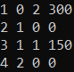
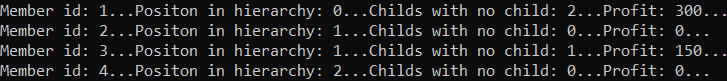

# Piramida Finansowa
#### *Financial pyramid scheme with diffrent values calculated for members of this structure*

## Screenshots:

  <kbd>
    
  </kbd>

  <kbd>
    
  </kbd>

## Technologies used:

| Technology | Link |
| :---: | :---: |
| IDE: Visual Studio 2019 | https://visualstudio.microsoft.com/vs |
| Language: C# | https://docs.microsoft.com/pl-pl/dotnet/csharp |
| Version Control: Git & Github | https://github.com |
| XML| https://www.w3schools.com/xml/xml_whatis.asp |

## Functional requirements:

| Id | Category | Name | Description | Required?(Y/N) | Done?(Y/N) |
| :---: | :---: | :---: | :---: | :---: | :---: |
| WF0 | Function | Read input files | Reading 2 input files, first for getting members scheme and second for getting their transactions | Y | - [ ] | - [X]
| WF1 | Function | Validate input files | Validate files to check if they meet requirements for Xml Reader | Y | Y |
| WF2 | Function | Parse data of each member | Get ids, positions in hierarchy, transactions etc. for each member | Y | Y |
| WF3 | Function | Send parsed member data to member object(class) | This helps with organization of code etc. | N | Y |
| WF4 | Function | Solve every subsection of financial pyramid scheme | Define owner, transfer all members money to owner and split earning for members that met requirements | Y | Y |
| WF5 | Function | Make path universal | Path to project location is dynamically changed whenever we change project's location | N | Y |
| WF6 | Testing | Manual Tests | Test code with different scenarios to remove bugs | Y | Y |
| WF7 | Testing | Unit Tests | Run unit test to eliminate even more dead ends | N | N |

